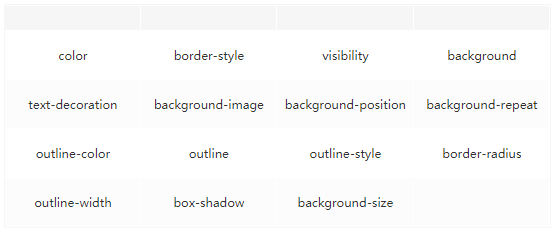

# 浏览器渲染机制


页面加载过程

* 浏览器根据 DNS 服务器得到域名的 IP 地址
* 向这个 IP 的机器发送 HTTP 请求
* 服务器收到、处理并返回 HTTP 请求
* 浏览器得到返回内容 一般返回内容都包含还 HTML CSS 和 JS 三部分,浏览器会解析这三种文件

1. 把HTML文件解析成DOM树
2. 解析CSS生成CSS规则树
3. 解析JS脚本,通过DOM API和CSSOM API来操作DOM树和CSS Rule树
4. 解析完成后,浏览器引擎会根据CSS树和DOM树构建Render Tress
5. 最后通过调用操作系统Native GUI的API绘制。

* Rendering Tree 渲染树并不等同于DOM树，渲染树只会包括需要显示的节点和这些节点的样式信息。
* CSS 的 Rule Tree主要是为了完成匹配并把CSS Rule附加上Rendering Tree上的每个Element（也就是每个Frame）。
* 然后，计算每个Frame 的位置，这又叫layout和reflow过程。

#### 构建DOM

解析二进制文件生成token串,然后读取token串生成节点对象,构成DOM树 CSSOM基本上同理,不过要注意**CSS匹配HTML元素是一个相当复杂和有性能问题的事情。所以，DOM树要小，CSS尽量用id和class，千万不要过渡层叠下去**

#### 构建渲染树

* 渲染树只会包括需要显示的节点和这些节点的样式信息，如果某个节点是 display:none 的，那么就不会在渲染树中显示。
* 如果遇到就停止渲染，执行 JS 代码。因为浏览器渲染和 JS 执行共用一个线程，而且这里必须是单线程操作，多线程会产生渲染 DOM 冲突。JavaScript的加载、解析与执行会阻塞DOM的构建，也就是说，在构建DOM时，HTML解析器若遇到了JavaScript，那么它会暂停构建DOM，将控制权移交给JavaScript引擎，等JavaScript引擎运行完毕，浏览器再从中断的地方恢复DOM构建。
* **JS文件不只是阻塞DOM的构建，它会导致CSSOM也阻塞DOM的构建**
* 这是因为JavaScript不只是可以改DOM，它还可以更改样式，也就是它可以更改CSSOM。因为不完整的CSSOM是无法使用的，如果JavaScript想访问CSSOM并更改它，那么在执行JavaScript时，必须要能拿到完整的CSSOM。所以就导致了一个现象，如果浏览器尚未完成CSSOM的下载和构建，而我们却想在此时运行脚本，那么浏览器将延迟脚本执行和DOM构建，直至其完成CSSOM的下载和构建。也就是说，在这种情况下，浏览器会先下载和构建CSSOM，然后再执行JavaScript，最后在继续构建DOM。

### 布局与重绘

当浏览器生成渲染树以后，就会根据渲染树来进行布局（也可以叫做回流）。这一阶段浏览器要做的事情是要弄清楚各个节点在页面中的确切位置和大小。通常这一行为也被称为“自动重排”。 布局流程的输出是一个“盒模型”，它会精确地捕获每个元素在视口内的确切位置和尺寸，所有相对测量值都将转换为屏幕上的绝对像素。 布局完成后，浏览器会立即发出“Paint Setup”和“Paint”事件，将渲染树转换成屏幕上的像素。

#### one more thing

引入JS 时async和defer的作用是什么

* 直接引用`情况1 <script src=“script.js”></script>` 没有 defer 或 async，浏览器会立即加载并执行指定的脚本，也就是说不等待后续载入的文档元素，读到就加载并执行
* 异步下载`<script async src=“script.js”></script>` async 属性表示异步执行引入的 JavaScript，与 defer 的区别在于，如果已经加载好，就会开始执行——无论此刻是 HTML 解析阶段还是 DOMContentLoaded 触发之后。需要注意的是，这种方式加载的 JavaScript 依然会阻塞 load 事件。换句话说，async-script 可能在 DOMContentLoaded 触发之前或之后执行，但一定在 load 触发之前执行。
* 延迟执行`<script defer src=“script.js”></script>` defer 属性表示延迟执行引入的 JavaScript，即这段 JavaScript 加载时 HTML 并未停止解析，这两个过程是并行的。整个 document 解析完毕且 defer-script 也加载完成之后（这两件事情的顺序无关），会执行所有由 defer-script 加载的 JavaScript 代码，然后触发 DOMContentLoaded 事件。 Defer 与相比普通 script，有两点区别：载入 JavaScript 文件时不阻塞 HTML 的解析，执行阶段被放到 HTML 标签解析完成之后；在加载多个JS脚本的时候，async是无顺序的加载，而defer是有顺序的加载。

回流和重绘 渲染流程实际上是: 计算CSS样式—>构建Render Tree —>Layout 定位坐标和大小—>绘制 JavaScript修改DOM属性或者CSS属性就会导致重新Layout,但是有些改变不会重新Layout. Repaint: 重绘：当我们对 DOM 的修改导致了样式的变化、却并未影响其几何属性（比如修改了颜色或背景色）时，浏览器不需重新计算元素的几何属性、直接为该元素绘制新的样式（跳过了回流环节）。 Reflow回流：当我们对 DOM 的修改引发了 DOM 几何尺寸的变化（比如修改元素的宽、高或隐藏元素等）时，浏览器需要重新计算元素的几何属性（其他元素的几何属性和位置也会因此受到影响），然后再将计算的结果绘制出来。这个过程就是回流（也叫重排）

回流必定会发生重绘，重绘不一定会引发回流。重绘和回流会在我们设置节点样式时频繁出现，同时也会很大程度上影响性能。回流所需的成本比重绘高的多，改变父节点里的子节点很可能会导致父节点的一系列回流。

**常见引起回流属性和方法**

任何会改变元素几何信息(元素的位置和尺寸大小)的操作，都会触发回流，

* 添加或者删除可见的DOM元素；
* 元素尺寸改变——边距、填充、边框、宽度和高度
* 内容变化，比如用户在input框中输入文字
* 浏览器窗口尺寸改变——resize事件发生时
* 计算 offsetWidth 和 offsetHeight 属性
* 设置 style 属性的值

**常见引起重绘属性和方法**



**如何减少回流、重绘**

* 使用 transform 替代 top
* 使用 visibility 替换 display: none ，因为前者只会引起重绘，后者会引发回流（改变了布局）
* 不要把节点的属性值放在一个循环里当成循环里的变量。

```
 for(let I = 0; I < 1000; I++) {
    // 获取 offsetTop 会导致回流，因为需要去获取正确的值
  console.log(document.querySelector(‘.test’).style.offsetTop)
}
```

* 不要使用 table 布局，可能很小的一个小改动会造成整个 table 的重新布局
* 动画实现的速度的选择，动画速度越快，回流次数越多，也可以选择使用 requestAnimationFrame
* CSS 选择符从右往左匹配查找，避免节点层级过多
* 将频繁重绘或者回流的节点设置为图层，图层能够阻止该节点的渲染行为影响别的节点。比如对于 video 标签来说，浏览器会自动将该节点变为图层
