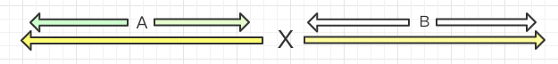
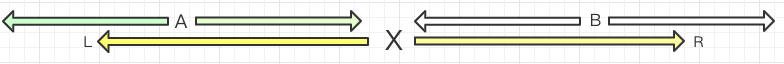

# 马拉车算法


&#x20;[最长回文子串](https://leetcode-cn.com/problems/longest-palindromic-substring/)

1. 求长的回文子串就要求出所有回文子串.
2. 对于每个回文子串都存在一个中心值,使左翼等于右翼,列表里没一项也都可以作为一个最大回文串的中心值,记为 centre\[i] = MAX ==> i 为列表下标,MAX为此元素为中心时最大的回文串的单翼长度.
3. 中心值可能为两数直间,所以参照中位数问题要向数组中插入虚拟值# `a b c c b a -> # a # b # c # c # b # a` 这样就可以保证始终选定在一个具体的值上. 这种状态下我们还可以发现填充后单翼长度就是填充前的总长度.
4. 对于某一点X,都有一种理想情况下能保证有点Centre\[B] == Center\[A] 其中B-X=X-A. 
5. 对于这种理想情况有几种特殊条件:

* A的单侧长度大于X单侧长度的半,这时我们只能保证R-B部分符合,剩下的则需要逐个去判定 
* A遇到了原列表左边界.这种情况下Centre\[A]只能为1,但是Centre不一定为1,要继续逐个判定
* B等于了R,中心扩散法逐个判断扩散.

1. L X R的更新, 为了最大化计算效率,我们应该把所有逐个计算过的数据都用上,即只要触发逐个判断并且完成了,就要把当前的回文串作为新的L X R,因为当前的右边界一定大于旧R(这就是触发逐个判断的条件)

```
 var longestPalindrome = function(s) {      
            
            var X = 1; //记录剩余未匹配项的起始位置
            var MAX = 0;//当前回文串的最大值
            var res = 1;
            var Dstr ='$#' + s.split('').join('#')+'#' //插入#,$标识边界
            var centre = [0,0]//前两位
            //R = X + centre[X]    L = X - centre[X] 
            var computeLength = (defaultValue, i) => {
                while(1){
                    if(Dstr[i + defaultValue + 1] == Dstr[i - defaultValue - 1]){//不符合回文
                        defaultValue ++;
                    }else{
                        centre[i] = defaultValue;
                        if(defaultValue > MAX){
                            MAX = defaultValue
                            res = i
                        }
                        if(i + centre[i] > X + centre[X]){
                            X = i
                        }
                        return;
                    }
                }
            }
            for(var i = 2; i<Dstr.length; i++){//先判断越界
                var i_mirror = 2 * X - i; // i的相对下标
               if(i_mirror == 1 ||  i + centre[i_mirror]  >= X + centre[X]){ // A遇到了原列表左边界 || B大于等于了R        对于初始状态,i会大于R 
                    computeLength(0,i)
                }else if((i - X) * 2 > centre[X] ){
                    computeLength(X + centre[X] - i, i)
                }else{
                    centre[i] = centre[ i_mirror] //理想情况等于关于X的对称点
                }
            }     
            return s.slice(parseInt((res - centre[res] )/2),parseInt((res - centre[res] )/2)+MAX) 
        };
        };
```
