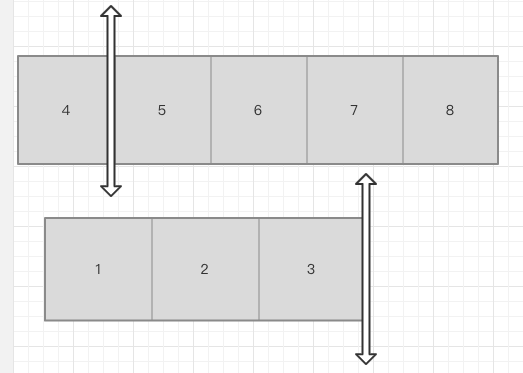
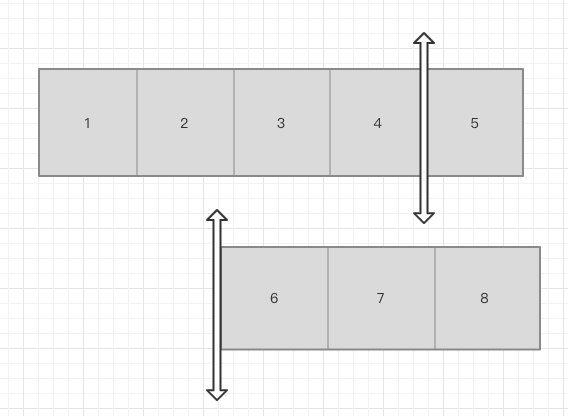
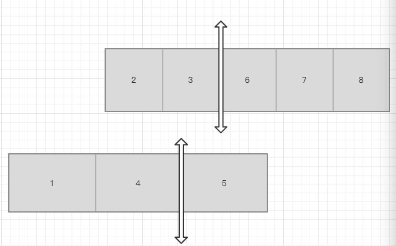

# 是数学!


* [寻找两个有序数组的中位数](https://leetcode-cn.com/problems/median-of-two-sorted-arrays/) ——边界处理&#x20;

取两个有序数组组合后的中位数,首先要明白中位数的定义,找到某值,使左边的值都比它小,右边值都比它大,且两边元素个数相等.

&#x20;所以最终我们要得到两个等量集合,集合中的元素由两个数组提供. 且小数集合中最大的数比大数集合中最小的数小.

&#x20;因为两数组总和固定,则集合数量固定(总数/2),且集合由两个数组构成,所以关注一个数组提供的数量既可. 从数组A提供0个元素给小数集合,A.length个元素给大数集合一直遍历到提供A.length给小数集合,0个元素给大数集合为止.&#x20;

成立条件是什么呢? A提供给小数集合里最大的数比B提供给大数集合里最小的数小(其实也要满足 A提供给小数集合里最大的数比A提供给大数集合里最小的数小,但因为是有序数组的分割所以左边的数肯定小于右边的数),对与数组B同理.&#x20;

不满足的时候我们就能根据具体条件判定割多了还是割少了,从而让切割点在数组上左右移动. 最终的结果就是A,B提供给小数集合里最大的元素中 比较大的元素,和A B提供给大数数组最小元素中 比较小的元素,相加除二.&#x20;

有几种特殊情况,就是割到某数组第一或最后元素的情况,

**割到尾** 

**割到头******

**割中间** 

可见头尾时就会出现一个假想值,为了消除他们,在取最大最小值的时候就要做特殊处理:&#x20;

//切在了短数组的最后一位,则短数组提供小的数为数组最后一个元素,大的数为假象值,要保证大的数不被取到,所以为无限大&#x20;

//切在了短数组的弟一位,则短数组提供小的数为假想值,大的数为第一个元素,要保证假想值不被取到,所以为无限小

但是!!!!!! 我们要知道中位数不一定存在于数组之中,中位数的计算也是有奇偶两种计算方式,对与奇数数组划分中位数的时候是存在割到某个数上的情况,这时这个数同时属于左右两边,那么怎么解决奇偶问题呢,嗯,当然是乘2,任何数乘2 都为偶,以此就可以统一奇偶情况,然后再找到对应的还原方式就好了 大值为mCut/2取整 小值为(mCut-1)/2取整

```
      var findMedianSortedArrays = function(nums1, nums2) {
         var m = nums1.length,
            n = nums2.length;
            if(m>n){ //保持查询最小的
                return findMedianSortedArrays(nums2,nums1); 
            }
        var begin = 0 , end = 2*m; // 把原数组放大二倍可保证始终为偶
        var mCut ,nCut;
        var res;
        var nMin,nMax,mMin,mMax;
        while(begin<=end){//二分查找
            mCut = parseInt((begin+end) / 2); 
            nCut = (m+n) - mCut; // (m*2+n*2)/2-mCut实际应该为
            mMax =  (mCut != 2 * m) ? nums1[parseInt(mCut / 2)] : Number.MAX_VALUE; //切在了短数组的最后一位,则短数组提供小的数为数组最后一个元素,大的数为假象值,要保证大的数不被取到,所以为无限大
            mMin =  (mCut != 0) ? nums1[parseInt((mCut - 1) / 2)] : - Number.MAX_VALUE;//切在了短数组的弟一位,则短数组提供小的数为假想值,大的数为第一个元素,要保证假想值不被取到,所以为无限小
            nMax =  (nCut != 2 * n) ? nums2[parseInt(nCut / 2)] : Number.MAX_VALUE;
            nMin = (nCut != 0) ? nums2[parseInt((nCut - 1) / 2)] : - Number.MAX_VALUE;
            if(mMin>nMax){//跟进结果进行继续进行二分查找
                end = mCut-1;
            } else if(nMin>mMax){
                begin = mCut+1;
            }else{
                break;
            }
        }
        return (Math.min(mMax,nMax) + Math.max(nMin,mMin))/ 2
    };
```

[最短无序连续子数组](https://leetcode-cn.com/problems/shortest-unsorted-continuous-subarray/)&#x20;

接触到此题第一反应肯定是排序一下,然后用俩指针分别从首位开始逐个对比,获取到第一个不匹配的位置和最后一个,可行,但是不够好,时间复杂度肯定高. 那么是不是可以这样:

1. 用一个指针从头开始对比,诸位判定是不是符合递增,如果不符合了,就记录当前值,然后从头再找一次它要插入的位置,这就是最终的子串起始位置. 仔细一想又不对,以为可能之后还有比这个值要小的数,所以应该全部查一遍,这时就会出现第一个值出现前比较的都是相邻两个元素,而第一个值出现后比较的就是当前最小值和当前遍历值..
2. 这样的遍历无法判定子串的起始位置,因为后面的值永远有可能插入到更前面的位置…
3. 等等,是不是有哪里好像不对,后面的值永远可能插入到更前面…也就是说我知道后面的值可不可能需要插入,那是不是只要遍历一次我就知道了最后一个需要插入的值.也就是结果子串的尾..
4. 同理,反向遍历一次也就能获得要最后一个向后插入的值,也就是结果子串的头. 容易造成误解的地方在于我们会考虑是不是存在某种情况,把某个元素插入到了我们计算的边界之前,导致边界出错.但实质上这种考虑是多余的,因为所有插入或者替换的操作都是停留在我们的假象层面,实际数组是不变的,所以我们正向处理和反向处理之间不会产生影响. 时间复杂度O(n),空间复杂度O(1),简直完美...

```
var findUnsortedSubarray = function(nums) {
        var foot = nums.length - 1; //数组尾坐标
        var max = nums[0];
        var min = nums[foot];
        var start = 0, end = -1; // 结果为0时抵消+1
        for(var i=0;i<= foot;i++){
            if(max>nums[i]){
                end = i;
            }else{
                max = nums[i];
            }
            if(min<nums[foot - i ]){
                start = foot - i ;
            }else{
                min = nums[foot - i];
            }
        }
        return end-start + 1;
}
```

* [只出现一次的数字](https://leetcode-cn.com/problems/single-number/)&#x20;

如果我们对 0 和二进制位做 XOR 运算，得到的仍然是这个二进制位 **a ^ 0 = a**\
如果我们对相同的二进制位做 XOR 运算，返回的结果是 0 **a ^ a = 0**\
XOR 满足交换律和结合律 **a^b^a = (a^a)^b = 0^b = b** 所以我们只需要将所有的数进行 XOR 操作，得到那个唯一的数字。 麻了,麻了...

```
var singleNumber = function(nums) {
    var res = 0;
    for(var i = 0;i<nums.length;i++){
        res ^=nums[i]
    }
    return res
};
```

* [多数元素](https://leetcode-cn.com/problems/majority-element/)&#x20;

这个算法乍一看是很难懂的,其实很简单,我们不要想如何找到众数,因为未遍历的元素是不确定的,所以我们要反过来想,找到那些不是众数的元素,

```
var majorityElement = function(nums) {
    var data;
    var num = 0;
    for(var i=0; i<nums.length;i++){
        if(num == 0){
            data = nums[i]
        }
         nums[i] == data ? num++ : num--    
    }
    return data
};

```
