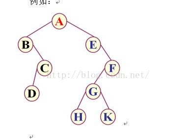
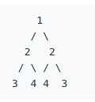

# 种树

有树如下



### 先序遍历

代码结构:

```
console.log(node.val)
DLR(node.left);
DLR(node.right);
```

根->左->右 ABCDEFGHK

### 中序遍历

代码结构:

```
LDR(node.left);
console.log(node.val)
LDR(node.right);
```

左跟右 BDCAEHGKF

对于搜索树中序遍历为升序,可以根据次特性进行搜索树检验

### 后序遍历

代码结构:

```
LRD(node.left);
LRD(node.right);
console.log(node.val)
```

左右根 DCBHKGFEA

#### 例题


解决树问题用的最多的就是递归,明确三点:

1. 当前节点逻辑处理
2. 递归结束条件
3. 节点递归迁移 [对称二叉树](https://leetcode-cn.com/problems/symmetric-tree/)&#x20;



```
function text(T1,T2){
    if(T1 == null & T2 ==null){
        return true; //当前路径结束,符合条件
    }
    if (T1 == null || T2 == null){
        return false; //当前路径结束,不符合条件
    }
    return (T1.val == T2.val) && text(T1.left,T2.right) && text(T2.left,T1.right) 
    //对于每对节点要满足两项,当前两个节点值对称,两个节点下属的节点也都正确
}
var isSymmetric = function(root) {
    return text(root,root)
};
```

[翻转二叉树](https://leetcode-cn.com/problems/invert-binary-tree/) 不会翻转二叉树可忒丢人了 **谷歌：我们90％的工程师使用您编写的软件(Homebrew)，但是您却无法在面试时在白板上写出翻转二叉树这道题，这太糟糕了。**

```
var invertTree = function(root) {
    if(root!=null){
        [root.left,root.right] = [invertTree(root.right),invertTree(root.left)]//转换递归一起哈成,很牛逼.
    }
    return root;
};
```

[二叉树的最大深度](https://leetcode-cn.com/problems/maximum-depth-of-binary-tree/)

```
var maxDepth = function(root) {
    if(root == null){
        return 0
    }
    return Math.max(maxDepth(root.left),maxDepth(root.right))+1
};
```

[不同的二叉搜索树 II](https://leetcode-cn.com/problems/unique-binary-search-trees-ii/)

```
var generateTrees = function(n) {
    if(n == 0){return []}
    function BST(start,end){
        var TreeList = [] 用来存当前递归的全部子树
        if(start > end){
            return [null]; //为空
        }
        if(start == end) {
            return [new TreeNode(start)];//单节点
        };
        for(var i = start; i<=end;i++){//以各个元素做跟
               var left = BST(start,i-1); //比当前元素小的元素集合
               var right  = BST(i+1,end); //比当前元素大的元素集合
               for(var x = 0;x<left.length;x++){
                   for(var y = 0;y<right.length;y++){//遍历两个集合           		 var node = new TreeNode(i)
                       node.left = left[x];
                       node.right = right[y];
                       TreeList.push(node)//添加一个可能的子树
                   }
               }
        }
        return TreeList;//返回全部可能的子树
    }
    return BST(1,n)
};
```

[验证二叉搜索树](https://leetcode-cn.com/problems/validate-binary-search-tree/)

```
//二叉搜索树满足中序遍历为升序
var isValidBST = function(root) {
    var pre = null //记录上一个遍历的节点
    function LDR(root){
        if(root == null){return true}//结束条件
        if(!LDR(root.left)){return false}//中序遍历
        if (pre != null && pre.val >= root.val) {return false}//上一个节点比这个节点大,不符合
        pre = root//更新上一个节点
        return LDR(root.right)//中序遍历   
    }
    return LDR(root)
};
```
